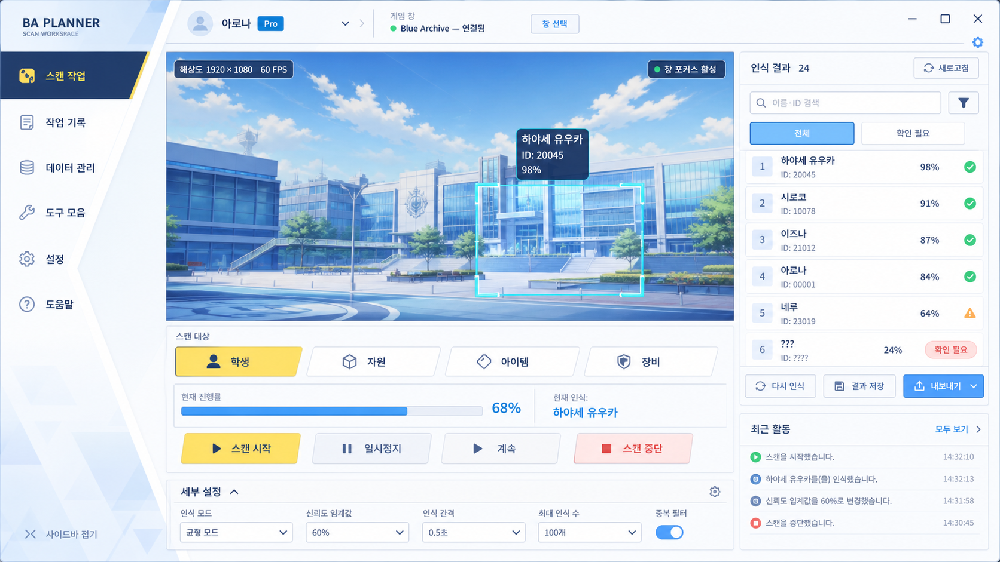
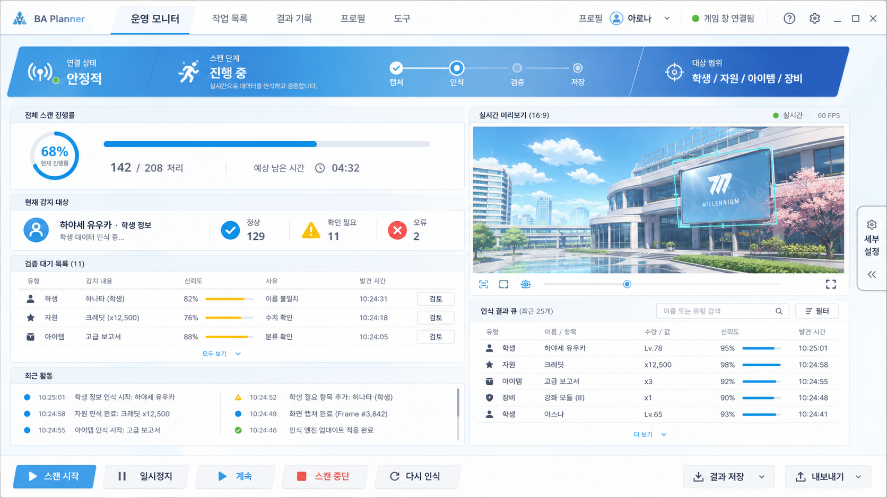
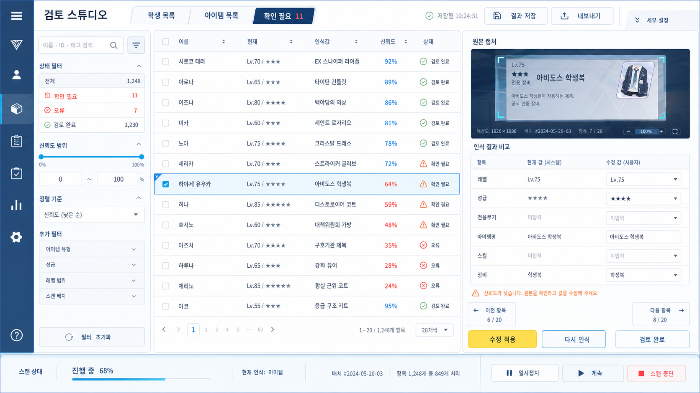

# ImageGen UI Concept Notes

These concepts are visual exploration only. They share a bright cyan-white, deep navy, and restrained yellow design language while assigning different priority to scanning, monitoring, and review. The reference images were used only for visual grammar; no characters, logos, layouts, or identifiable game assets were copied.

## Concept A — Scan Workspace

### Defining layout idea

A large central 16:9 capture preview acts as the evidence and control center. A compact angled navigation rail anchors the left edge, scan controls sit directly below the preview, and a narrow recognition list and activity column remain visible on the right.

### Strongest qualities

- The current scan target, live capture, progress, current recognition, and stop action form one clear operating loop.
- The preview receives the strongest emphasis without hiding recognition results.
- Scan-target controls use a compact game-menu rhythm rather than generic dashboard cards.
- The selected, inactive, warning, confidence, and progress states are easy to distinguish.
- The secondary settings row is visible but does not compete with scanning.

### Weakest qualities

- The left navigation and right result column reduce the maximum preview width at smaller resolutions.
- Showing start, pause, resume, and stop simultaneously is useful for exploration but should become state-dependent in production.
- The scenic placeholder preview may draw slightly more attention than real captured game data would.

### Best-supported workflow

Actively selecting a scan target, starting capture, watching the current detection, intervening with pause or stop, and checking newly recognized entries.

### Potentially difficult implementation details

- Maintaining a true 16:9 preview while the right result column and settings area resize.
- Keeping the angled rail and clipped target controls aligned across DPI scales.
- Drawing a performant recognition rectangle over a live capture surface.
- Preserving readable Korean labels in the compact command row at 1600×900.

### Reference-image qualities incorporated

- Strong diagonal division and an image-dominant half from Reference 1.
- Airy sky luminosity, pale cyan layering, and scenic feature area from Reference 2.
- Compact menu controls and restrained yellow active state from References 1 and 3.
- Slanted white panels, navy outlines, and cyan progress treatment from Reference 4.

### Simplify during HTML implementation

- Use one or two reusable `clip-path` shapes instead of unique angles per component.
- Replace decorative background facets with a single subtle pseudo-element pattern.
- Render only actions valid for the current scanner state; keep inactive actions in an overflow menu if necessary.
- Collapse recent activity before shrinking the preview below its useful minimum width.

## Concept B — Operations Monitor

### Defining layout idea

A horizontal navigation and broad angled status ribbon establish an operations view. The left side concentrates progress, current target, verification queue, and recent activity; the right side retains a medium live preview and recognized-result queue. A fixed bottom command strip keeps interventions immediately available.

### Strongest qualities

- Scan phase, connection health, progress, processed count, remaining time, warnings, and errors read as one operational system.
- Verification work is integrated into the running scan rather than isolated in a separate dashboard.
- Recent activity has enough density for long-running scans without exposing the full technical log.
- The preview remains useful and correctly secondary to operational state.
- Warning and error states combine icons, labels, counts, and color.

### Weakest qualities

- The progress area uses a circular treatment that can feel more dashboard-like than the other concepts.
- The amount of persistent status information increases visual density and may be excessive for short scans.
- The bottom command strip consumes height that could otherwise support more activity rows.

### Best-supported workflow

Watching a long scan, spotting stalled or uncertain recognition, reviewing recent events, and safely pausing, stopping, or retrying work.

### Potentially difficult implementation details

- Coordinating live updates across progress, phase steps, status counts, queues, preview, and activity without distracting motion.
- Keeping the angled status ribbon responsive while maintaining clear phase spacing.
- Virtualizing activity and result rows while preserving aligned columns.
- Ensuring the fixed command strip does not collide with Windows scaling or reduced viewport height.

### Reference-image qualities incorporated

- Broad slanted structural split and guided diagonal attention from Reference 1.
- Light layered menu field and luminous cyan backdrop from Reference 2.
- Compact centered action grouping from Reference 3.
- Long navy progress tracks and clipped white panel silhouette from Reference 4.

### Simplify during HTML implementation

- Replace the circular progress indicator with a compact linear meter if the screen starts to resemble analytics software.
- Keep only the current and next scan phases prominent; dim completed and later phases.
- Limit recent activity to a short virtualized list and move raw logs into the collapsed drawer.
- Implement the status ribbon as rectangular sections with angled pseudo-element dividers.

## Concept C — Review Studio

### Defining layout idea

A three-pane correction studio makes recognized data the primary workspace: filters and navigation on the left, a dense comparison table in the center, and evidence plus correction fields on the right. A thin bottom strip preserves live scan status without competing with review.

### Strongest qualities

- Search, confidence filtering, sorting, selection, evidence, correction, and completion form a direct review loop.
- Dense aligned rows support rapid comparison better than a card grid.
- The selected uncertain row is connected visually to its original capture and editable correction values.
- Completed, uncertain, and error states are distinct without relying only on color.
- Saving, export, auto-save, and scan status remain visible but secondary.

### Weakest qualities

- The three-pane layout needs a larger minimum width than Concepts A or B.
- The evidence preview becomes relatively small at 1600×900.
- The current/recognized/corrected terminology will need careful product copy to avoid ambiguity with growth-planning “current” and “target” values.
- A permanently open correction form may feel heavy when most results are high confidence.

### Best-supported workflow

Searching recognized entries, filtering uncertain results, comparing evidence, correcting values, marking items reviewed, and saving or exporting a clean result set.

### Potentially difficult implementation details

- Resizable panes with sensible minimum widths and predictable keyboard focus.
- Table virtualization, sticky headers, aligned numeric columns, and persistent selection.
- Synchronizing the selected row, capture evidence, validation warnings, and unsaved edits.
- Moving the detail inspector into a drawer or separate step below 1600×900 without losing review context.

### Reference-image qualities incorporated

- Navy structural edge and sharp diagonal selection cue from Reference 1.
- Bright white/cyan layered workspace and airy visual weight from Reference 2.
- Compact segmented tabs and centered action hierarchy from Reference 3.
- Thin navy row structure, cyan progress, and clipped panel headers from Reference 4.

### Simplify during HTML implementation

- Use a standard CSS grid for the three panes and reserve clipped shapes for headers and selection markers only.
- At narrower widths, hide the filter pane behind a drawer and convert the detail pane to a slide-over inspector.
- Render correction controls only for the selected field group instead of exposing every editable field simultaneously.
- Use a real table for aligned comparison data and avoid decorative skew transforms on rows or inputs.

## Shared implementation guidance

- Build the visual language from a small token set: deep navy text and borders, white and pale cyan surfaces, cyan interaction/progress, yellow primary selection, coral warning, red error, and green completion.
- Keep radii low and reserve trapezoidal silhouettes for navigation, section headers, or one major structural panel per region.
- Treat atmospheric gradients and translucent layers as background support, never as a substitute for hierarchy.
- Preserve the brief’s semantic distinctions: scanned current state, user target, total required, inventory owned, and shortage must remain separate.
- At 1600×900, collapse settings and activity first. For Concept C, collapse filters or the inspector rather than compressing all three panes.
- Generated Korean labels should be replaced with real application text components during implementation; the mockups establish hierarchy and density, not final typographic fidelity.
