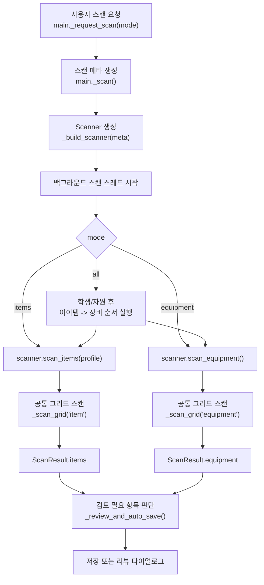
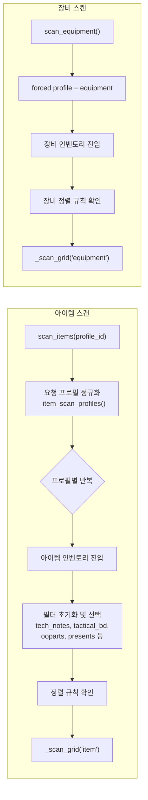
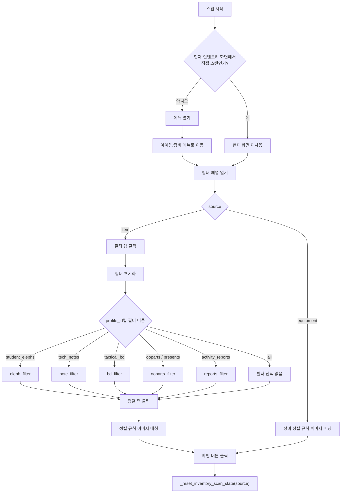
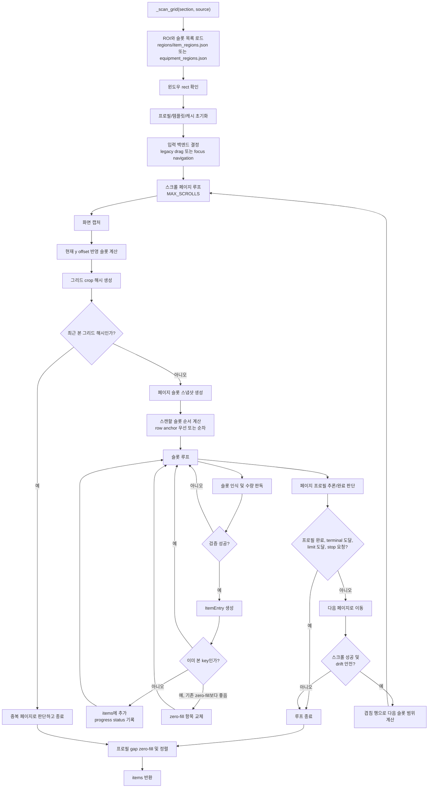
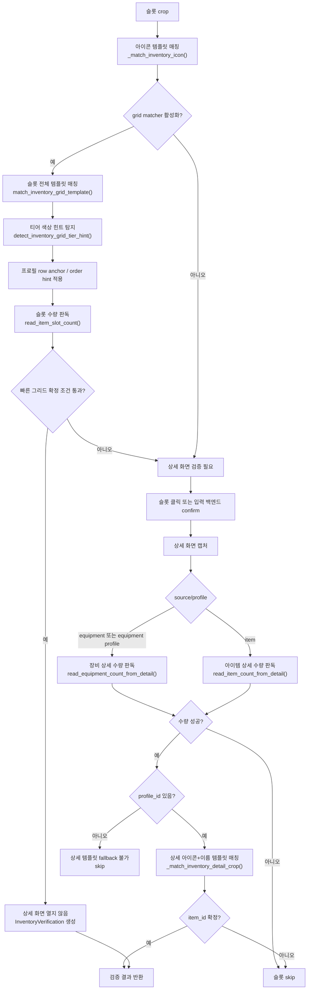
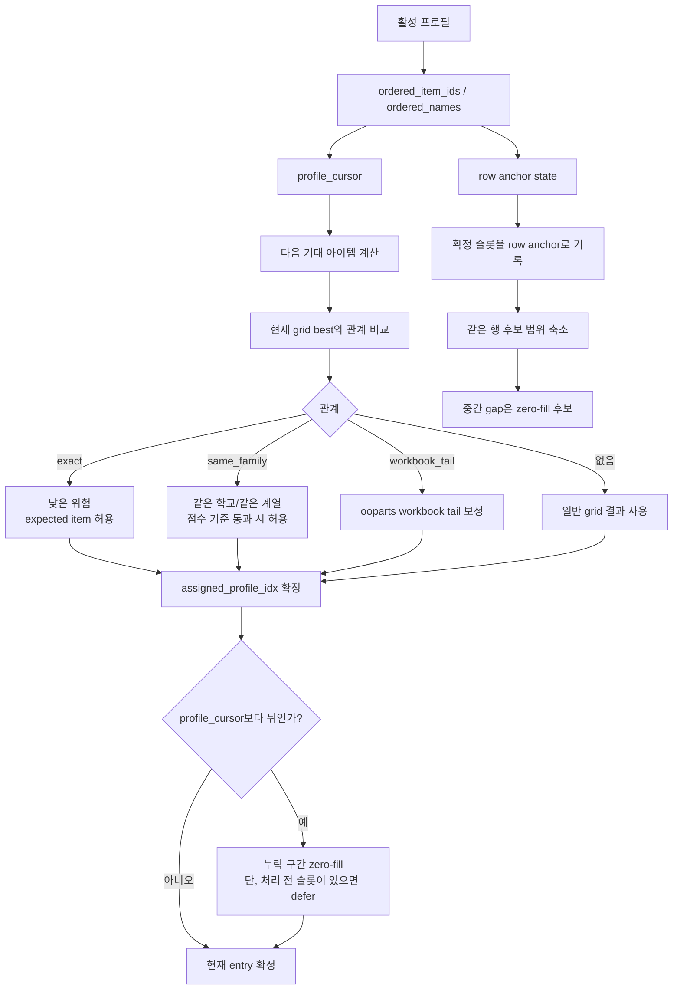
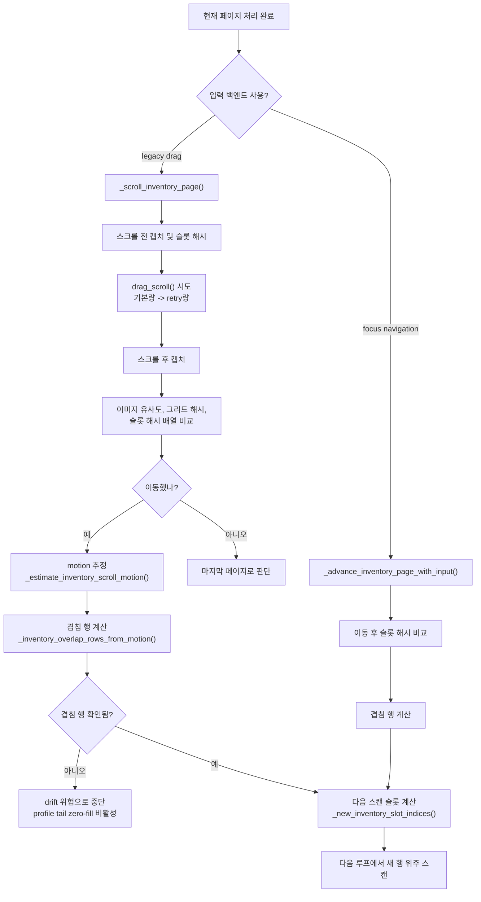
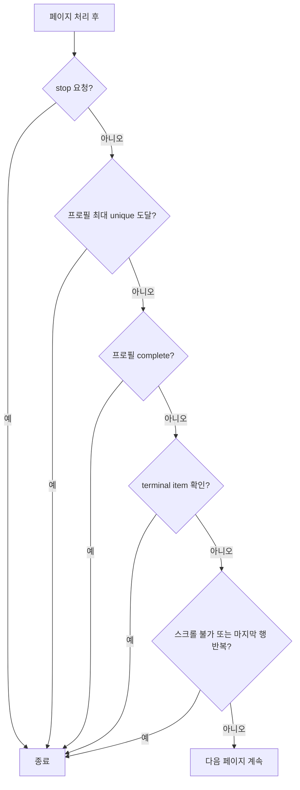

# 아이템/장비 스캔 알고리즘

이 문서는 현재 아이템 및 장비 인벤토리 스캔 흐름을 Mermaid 다이어그램으로 정리한다.
코드 기준 진입점은 `main.py`의 `_run_scan_task()`, 실제 스캔 엔진은
`core/scanner.py`의 `scan_items()`, `scan_equipment()`, `_scan_grid()`이다.

## 전체 호출 흐름



## 아이템과 장비의 차이



아이템은 선택한 프로필을 여러 번 순회할 수 있다. 예를 들어 전체 스캔에서는
`tech_notes`, `tactical_bd`, `ooparts`, `presents`, `activity_reports`,
`student_elephs` 같은 프로필을 각각 준비하고 `_scan_grid()`를 실행한다.

장비는 `equipment` 프로필을 강제로 사용한다. 그래서 공통 그리드 엔진을 쓰지만
장비용 정렬 확인, 장비용 상세 템플릿, 장비용 수량 템플릿이 선택된다.

## 인벤토리 준비 단계



## 공통 그리드 스캔 루프



## 슬롯 하나를 판독하는 절차



빠른 경로는 `grid_template_score`, `margin`, `count_confidence`가 기준 이상일 때
상세 화면을 열지 않고 확정한다. 기준에 못 미치면 같은 슬롯을 열어 상세 화면에서
수량과 상세 템플릿을 다시 확인한다.

그리드 후보 생성은 프로필별 정책을 사용한다. 활동 보고서는 배경 티어로 후보를 한
개로 제한하고, 기술 노트와 전술 BD는 티어를 먼저 고른 뒤 각각의 학교 문양 ROI를
비교한다. 선물은 노랑/보라 희귀도 배경으로 후보를 나눈 뒤 전용 object ROI를
사용하며, 엘레프는 배경 티어 없이 얼굴과 외형 ROI를 결합한다. 오파츠는 티어별
가족 후보와 노란 배경의 워크북 3종 후보를 별도 branch로 평가한다.

## 프로필과 순서 힌트

### 페이지 공동 추론 shadow 방식

`presents`, `student_elephs`, `tactical_bd`, `tech_notes`, `equipment`는 페이지 공동 추론을
기본 판정으로 사용한다. 강제된 인벤토리 프로필과 grid matcher가 모두 활성화되어야 동작한다.
각 페이지의 슬롯은 row anchor 없이
병렬로 Top-K 후보를 만들고, `core/inventory_page_shadow.py`가 프로필 순번이 단조 증가하는
최적 경로를 계산한다. 공동 추론에서 확정된 item ID가 실제 결과와 profile cursor에 사용되며,
수량 신뢰도가 낮으면 기존 상세 화면 검증은 계속 수행한다. 공동 추론이 준비되지 못한 페이지는
기존 판정으로 조용히 전환하지 않고 스캔을 불완전 종료한다.

첫 페이지의 worker 실행 전에 메인 스레드가 현재 슬롯 크기에 필요한 모든 템플릿 crop을 한 번
생성해 LRU cache에 넣는다. 따라서 여러 worker가 같은 템플릿을 동시에 처음 읽고 변환하는 cold
miss가 제거된다. 같은 프로필과 슬롯 크기는 이후 페이지에서 다시 prewarm하지 않는다.

`BA_INVENTORY_PAGE_SHADOW_AUTHORITATIVE=0`을 설정하면 공동 추론을 다시 비교 전용 모드로
내릴 수 있다. `BA_INVENTORY_PAGE_SHADOW=0`은 기능 전체를 끈다. 위 목록 외 프로필은 공동
추론을 명시적으로 켜더라도 아직 기본 판정으로 승격되지 않는다.

기본 평가 설정은 다음 환경 변수로 조정할 수 있다.

| 환경 변수 | 기본값 | 의미 |
| --- | ---: | --- |
| `BA_INVENTORY_PAGE_SHADOW_WORKERS` | `4` | 슬롯 후보 생성 worker 수 |
| `BA_INVENTORY_PAGE_SHADOW_TOP_K` | `4` | 슬롯별 유지 후보 수 |
| `BA_INVENTORY_PAGE_SHADOW_MIN_SCORE` | `0.55` | 공동 추론에 넣을 최소 시각 점수 |
| `BA_INVENTORY_PAGE_SHADOW_AUTHORITATIVE` | `1` | 승격 프로필에서 공동 추론 결과를 실제 판정으로 사용 (`0`: 비교 전용) |

일반 로그에는 prewarm 템플릿 수·cache hit/miss·처리시간과 페이지별 할당됨·미해결·실제 반영
수가 남는다. 비교 전용 모드에서는 기존 결과 대비 agreement 집계와 debug 불일치도 기록한다.
다음 실측에서는 단독 판정 로그뿐 아니라 실제 캡처 답지와 최종 결과를 함께 대조해야 한다.



프로필 기반 스캔은 게임 인벤토리가 보유 수량 0인 항목을 표시하지 않는 점을 이용한다.
정렬 순서가 보장되는 프로필에서 뒤쪽 항목이 확정되면, 그 사이에 비어 있는 항목은
`quantity = "0"`인 `zero_filled` 항목으로 보강할 수 있다.

## 스크롤과 drift 방지

드래그 직후의 첫 캡처는 모션 추정에 바로 사용하지 않는다. 스캐너는 짧은 간격의 후속 캡처에서
회색 밴드 중심 좌표를 비교하고, 행 간격의 1% 이내로 연속 두 번 유지된 마지막 프레임만
스크롤 후 안정 프레임으로 채택한다. 제한된 캡처 횟수 안에 안정화되지 않으면 이동량을
추정하지 않고 스캔을 중단한다. 따라서 이동량과 겹침 행은 스크롤 전 안정 프레임과 스크롤 후
안정 프레임 사이에서만 계산된다.

5행 그리드에서 행 간격에 맞는 회색 밴드가 6개 검출되면, 가장 위 밴드는 첫 행의 위쪽 경계로
취급한다. 각 행 중심은 인접한 밴드 두 개 사이에 배치한다. 유효한 6밴드 연속열이 없을 때만
기존처럼 5개 아래쪽 밴드와 추정된 위쪽 경계를 사용한다.

코사인 기반 모션 추정이 겹침 행을 0으로 계산하면 슬롯 아이콘 해시의 행 중복을 교차검증한다.
해시에서 중복 행이 확인되면 해당 값을 우선하여 잘못된 원거리 상관 피크를 복구한다. 마지막
페이지 signature가 확인된 경우에는 겹침 행 소실로 중단하지 않고 전체 슬롯을 한 번 검사한 뒤
종료한다. 상세 검증 클릭은 슬롯 내부에서 금지구역 바로 위의 허용 좌표로 보정하며, 클릭 자체가
실패하면 이전 상세 화면을 읽지 않고 해당 검증을 실패 처리한다.



스크롤 후 겹침 행이 없으면 사용자 조작, 튐, 드래그 drift 가능성이 있다고 보고
스캔을 멈춘다. 이 경우 프로필의 남은 꼬리 항목을 0으로 채우지 않는다.

## 종료 조건



## 주요 데이터와 결과

| 항목 | 위치 | 역할 |
| --- | --- | --- |
| `ItemEntry` | `core/scanner.py` | 스캔 결과 한 줄. `name`, `quantity`, `item_id`, `source`, `scan_meta`를 보유한다. |
| `InventoryScanProfile` | `core/inventory_profiles.py` | 프로필별 정렬 순서, 예상 item_id, terminal item을 정의한다. |
| `InventoryGridRowAnchorState` | `core/inventory_grid_matcher.py` | 확정된 슬롯과 프로필 인덱스를 이용해 같은 행 후보를 좁힌다. |
| `InventoryVerification` | `core/scanner.py` | 빠른 그리드 경로 또는 상세 화면 검증 결과를 담는다. |
| `scan_meta` | `main.py`, `core/scanner.py` | 필터, 직접 인벤토리 스캔 여부, 디버그 로그 경로 등 실행 메타데이터를 전달한다. |

`scan_meta` 안의 `detect_source`는 결과가 어떤 경로로 확정되었는지 알려준다.
대표 값은 `grid_template(...)`, `detail_image_template+detail(...)`,
`icon_template+detail(...)`, `detail_template`이다.

## 계정·해상도별 답지 샘플

아이템과 장비의 상세 화면 검토에서 사용자가 항목을 확정하면 상세 이미지와 이름 영역을
현재 계정 프로필 아래에 답지 샘플로 저장한다. 자동 판정만으로는 샘플을 만들지 않는다.

```text
profiles/{profile_key}/templates/inventory_detail/
└─ {capture_width}x{capture_height}/
   └─ {inventory_profile_id}/
      └─ {item_id}/
         ├─ {scan_id}.png
         └─ {scan_id}.json
```

이름 영역 샘플은 같은 구조를 `inventory_detail_names/` 아래에 사용한다. 해상도 키는
내부 인식용 QHD 정규화 크기가 아니라 캡처 이미지의 `capture_source_size`, 즉 실제 게임
창의 client 크기다.

- 해당 계정·해상도의 샘플이 없는 첫 스캔은 배포 기본 에셋만 사용한다.
- 이후 같은 계정과 같은 해상도의 스캔은 저장된 모든 확정 샘플을 후보로 먼저 추가한다.
- 배포 기본 에셋도 후보에 남겨 사용자 샘플이 약하거나 없는 항목의 fallback으로 사용한다.
- 다른 해상도 또는 다른 계정의 샘플은 후보에 포함하지 않는다.
- 동일 item_id의 샘플은 덮어쓰지 않고 누적한다. 같은 scan_id가 이미 있으면 번호 suffix를 붙인다.
- 무기 성장 부품은 기존 정책대로 사용자 상세 샘플 대상에서 제외한다.
- 해상도를 알 수 없는 결과는 잘못된 공용 샘플 생성을 막기 위해 저장하지 않는다.

해상도 분리 이전에 저장된 `inventory_detail/{profile_id}/{item_id}.png` 형식은 호환
fallback으로 읽지만, 새 샘플은 항상 해상도별 구조에만 기록한다.

## 관련 코드 지도

| 흐름 | 함수 |
| --- | --- |
| UI 요청 및 스레드 실행 | `main._request_scan()`, `main._scan()`, `main._run_scan_task()` |
| 아이템 진입점 | `Scanner.scan_items()` |
| 장비 진입점 | `Scanner.scan_equipment()` |
| 필터/정렬 준비 | `Scanner._prepare_item_inventory()`, `Scanner._prepare_equipment_inventory()` |
| 공통 그리드 엔진 | `Scanner._scan_grid()` |
| 빠른 슬롯 매칭 | `match_inventory_grid_template()`, `read_item_slot_count()` |
| 상세 화면 검증 | `Scanner._verify_inventory_slot()` |
| 상세 템플릿 매칭 | `Scanner._match_inventory_detail_crop()` |
| 스크롤 및 겹침 계산 | `Scanner._scroll_inventory_page()`, `_new_inventory_slot_indices()` |
| 프로필 추론/완료 | `infer_inventory_scan_profile()`, `is_inventory_profile_complete()`, `is_inventory_profile_terminal_seen()` |
