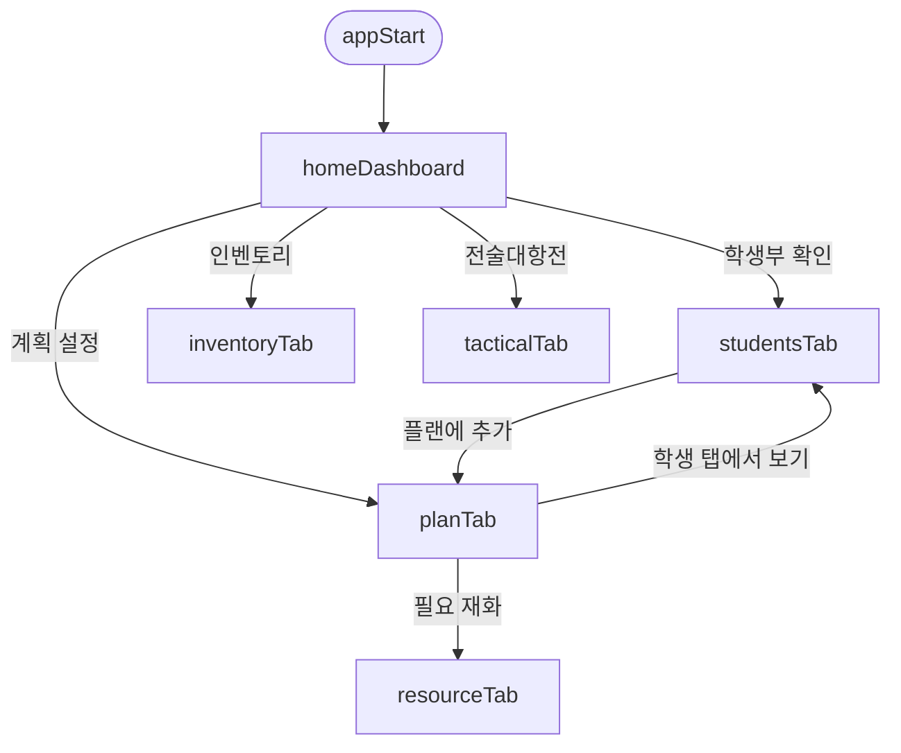

# BA Planner UI 섹션 연결 지도

이 문서는 버튼의 세부 처리보다 화면의 큰 섹션이 어떻게 연결되는지 보여준다.

```mermaid
flowchart TD
    START([appStart]) --> HOME[homeDashboard]
    HOME -->|학생부 확인| STUDENTS[studentsTab]
    HOME -->|계획 설정| PLAN[planTab]
    HOME -->|인벤토리| INVENTORY[inventoryTab]
    HOME -->|전술대항전| TACTICAL[tacticalTab]
    STUDENTS -->|플랜에 추가| PLAN
    PLAN -->|학생 탭에서 보기| STUDENTS
    PLAN -->|필요 재화| RESOURCES[resourceTab]
```

## 범위

- 포함: 메인 탭, 스택 페이지, 주요 섹션, 다이얼로그를 바꾸는 버튼과 시스템 이벤트
- 제외: 새로고침, 복사, 삭제, 검색어 변경 등 현재 섹션 안에서 끝나는 동작
