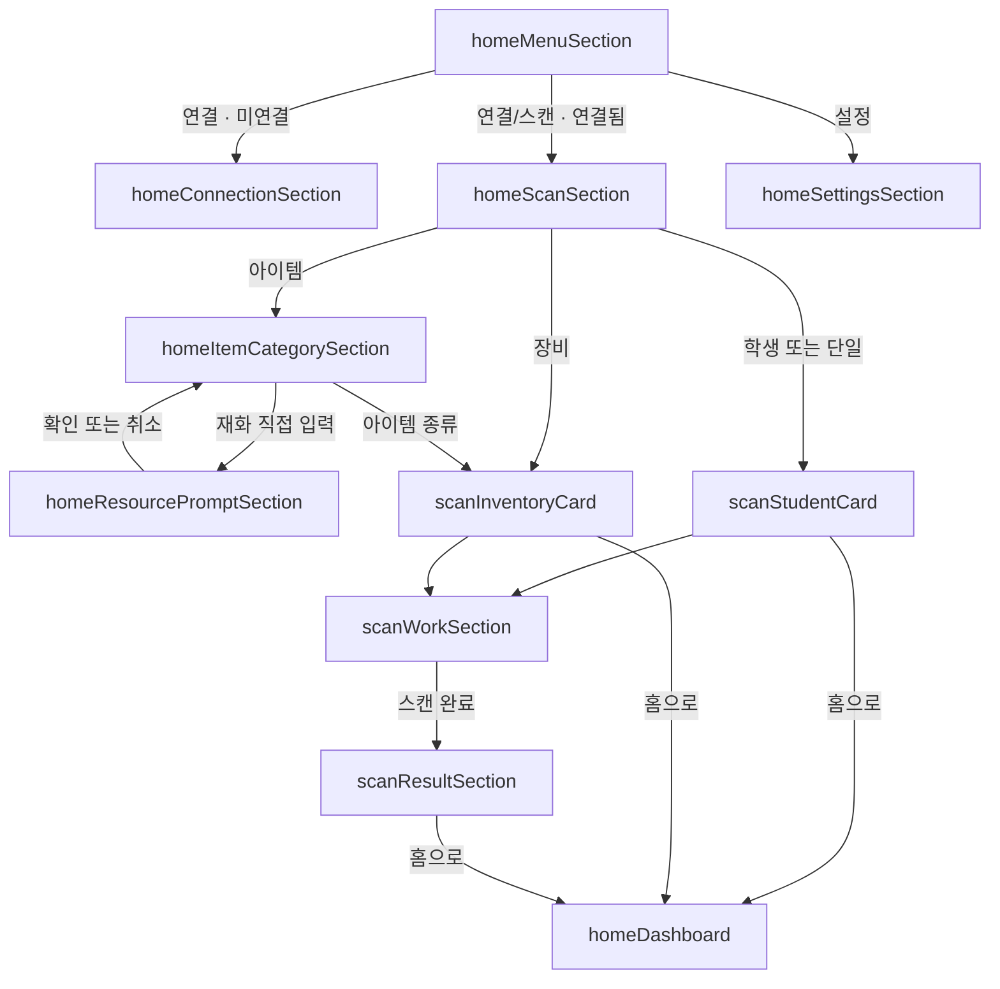

# 홈 섹션 연결

```mermaid
flowchart TD
    MENU[homeMenuSection]
    CONNECT[homeConnectionSection]
    SCAN_MENU[homeScanSection]
    SETTINGS[homeSettingsSection]
    ITEM_KIND[homeItemCategorySection]
    RESOURCE[homeResourcePromptSection]
    STUDENT_SCAN[scanStudentCard]
    ITEM_SCAN[scanInventoryCard]
    WORK[scanWorkSection]
    RESULT[scanResultSection]
    DASHBOARD[homeDashboard]

    MENU -->|연결 · 미연결| CONNECT
    MENU -->|연결/스캔 · 연결됨| SCAN_MENU
    MENU -->|설정| SETTINGS
    SCAN_MENU -->|아이템| ITEM_KIND
    ITEM_KIND -->|재화 직접 입력| RESOURCE
    RESOURCE -->|확인 또는 취소| ITEM_KIND
    SCAN_MENU -->|학생 또는 단일| STUDENT_SCAN
    SCAN_MENU -->|장비| ITEM_SCAN
    ITEM_KIND -->|아이템 종류| ITEM_SCAN
    STUDENT_SCAN --> WORK
    ITEM_SCAN --> WORK
    WORK -->|스캔 완료| RESULT
    STUDENT_SCAN -->|홈으로| DASHBOARD
    ITEM_SCAN -->|홈으로| DASHBOARD
    RESULT -->|홈으로| DASHBOARD
```

## 전환 기준

스캔 중지, 로그 갱신, 진행률 갱신은 섹션 자체를 바꾸지 않으므로 지도에서 제외한다.
