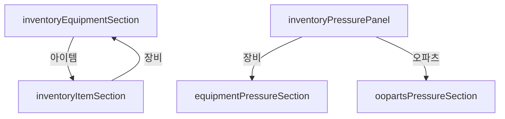

# 인벤토리 섹션 연결

```mermaid
flowchart TD
    EQUIPMENT[inventoryEquipmentSection]
    ITEM[inventoryItemSection]
    PRESSURE[inventoryPressurePanel]
    EQUIPMENT_PRESSURE[equipmentPressureSection]
    OOPARTS_PRESSURE[oopartsPressureSection]

    ITEM -->|장비| EQUIPMENT
    EQUIPMENT -->|아이템| ITEM
    PRESSURE -->|장비| EQUIPMENT_PRESSURE
    PRESSURE -->|오파츠| OOPARTS_PRESSURE
```
