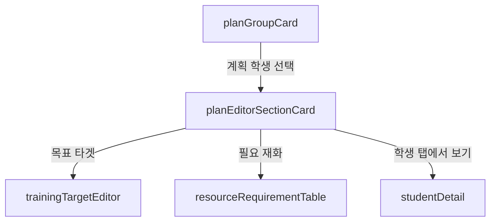

# 계획 섹션 연결

```mermaid
flowchart TD
    GROUP[planGroupCard]
    EDITOR[planEditorSectionCard]
    TARGET[trainingTargetEditor]
    RESOURCE[resourceRequirementTable]
    STUDENT[studentDetail]

    GROUP -->|계획 학생 선택| EDITOR
    EDITOR -->|목표 타겟| TARGET
    EDITOR -->|필요 재화| RESOURCE
    EDITOR -->|학생 탭에서 보기| STUDENT
```
