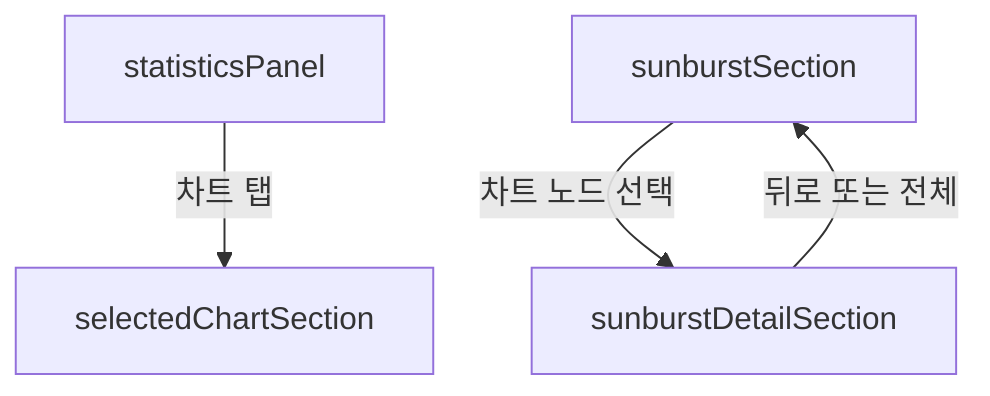

# 통계 섹션 연결

```mermaid
flowchart TD
    PANEL[statisticsPanel]
    CHART[selectedChartSection]
    SUNBURST[sunburstSection]
    DETAIL[sunburstDetailSection]

    PANEL -->|차트 탭| CHART
    SUNBURST -->|차트 노드 선택| DETAIL
    DETAIL -->|뒤로 또는 전체| SUNBURST
```
