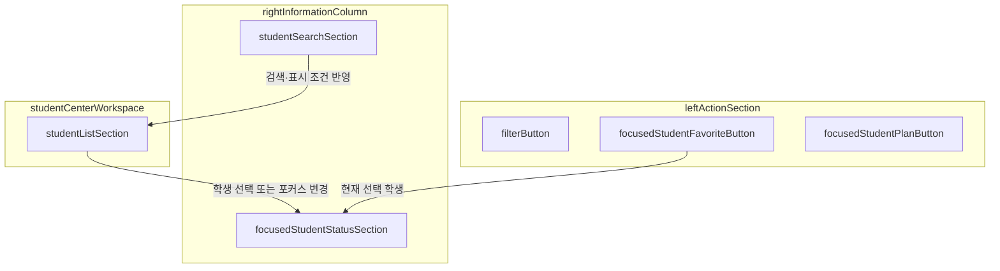
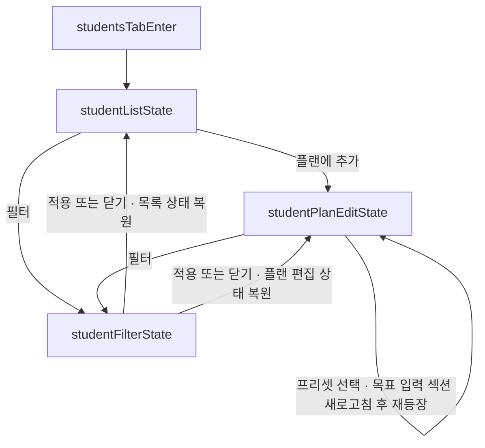
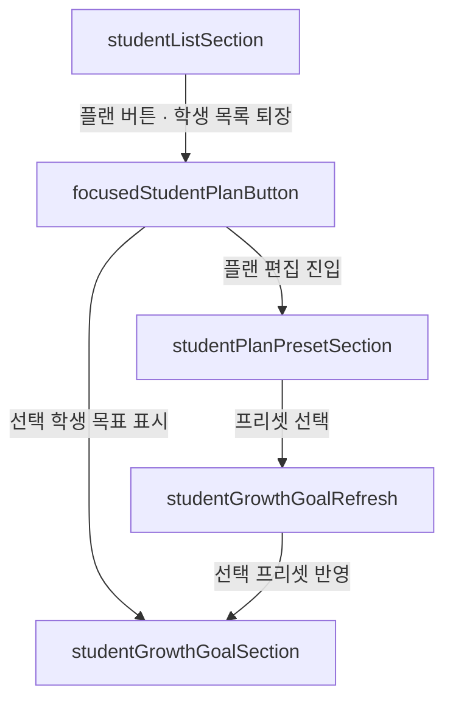
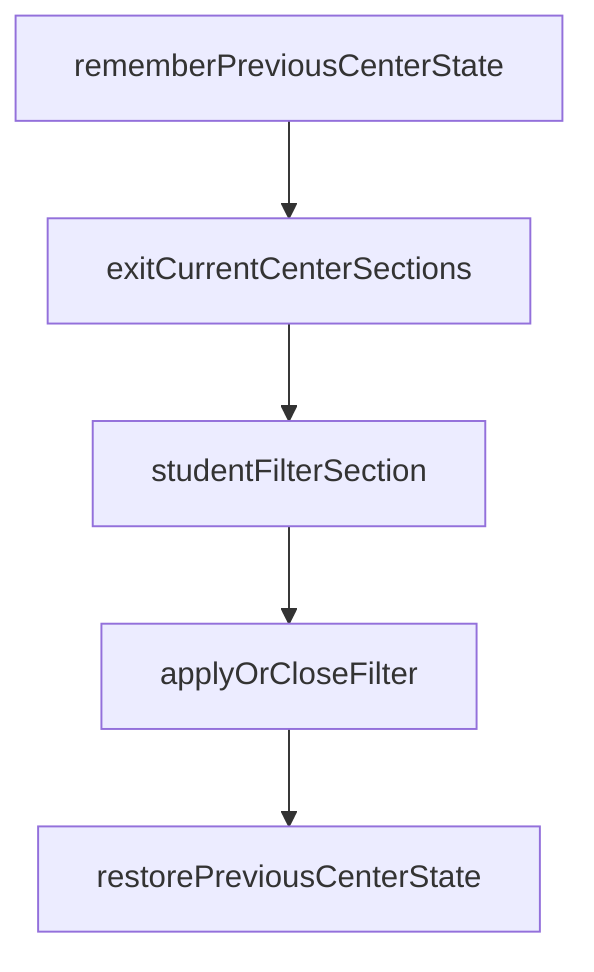
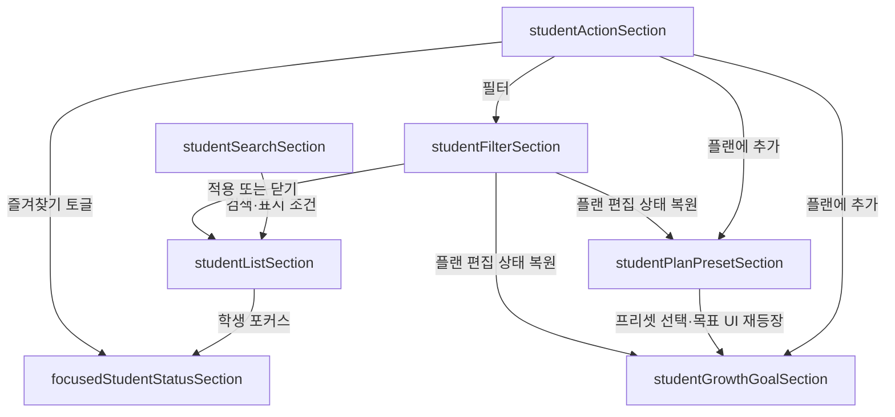

# 신규 학생 탭 목업

> 상태: UI 구조 검토용 초안  
> 범위: 섹션 배치와 화면 전환만 정의한다. 백엔드, 저장, 계산, 애니메이션 수치는 구현 범위에 포함하지 않는다.

## 1. 기본 화면 배치

학생 탭은 고정된 좌측 행동 섹션과 우측 정보 열 사이에, 상태에 따라 내용이 교체되는 중앙 작업 영역을 둔다.

| 좌측 행동 섹션 | 중앙 작업 영역 | 우측 정보 열 |
| --- | --- | --- |
| 필터 | 학생 목록 섹션 | 검색 섹션 |
| 즐겨찾기 토글 |  | 선택 학생 상태 섹션 |
| 플랜에 추가 |  |  |

### 좌측 행동 섹션

- `필터`: 현재 중앙 섹션을 잠시 퇴장시키고 필터 섹션을 연다.
- `선택 학생 즐겨찾기 토글`: 현재 포커스된 학생의 즐겨찾기 상태를 전환한다.
- `선택 학생 플랜에 추가`: 현재 포커스된 학생을 대상으로 중앙 작업 영역을 플랜 편집 상태로 전환한다.
- 포커스된 학생이 없을 때의 버튼 활성화 규칙은 실제 구현 전에 별도로 결정한다.

### 검색 섹션

- 학생 검색바
- 계획에 포함된 학생만 표시
- 미보유 학생 표시 여부
- JP 서버에만 존재하는 학생 표시 여부
- 검색 조건은 학생 목록의 표시 결과만 바꾸며 학생의 현재 상태나 성장 목표를 수정하지 않는다.

### 선택 학생 상태 섹션

- 학생 목록에서 현재 포커스된 학생의 스캔된 보유·성장 상태를 보여준다.
- 정적 학생 메타데이터를 함께 표시할 수 있지만, 성장 목표나 필요 재화와 현재 상태를 같은 값으로 합치지 않는다.
- 미보유 학생은 현재 성장 상태가 없는 학생으로 표현하고 가상의 현재값을 채우지 않는다.

## 2. 중앙 작업 영역 상태

| 중앙 상태 | 보이는 섹션 | 진입 동작 | 이탈 동작 |
| --- | --- | --- | --- |
| 학생 목록 | 학생 목록 섹션 | 학생 탭 최초 진입 | 플랜 또는 필터 진입 전에 퇴장 |
| 플랜 편집 | 프리셋 설정 섹션 + 성장 목표 입력 섹션 | 선택 학생의 플랜 버튼 | 필터 진입 전에 두 섹션 모두 퇴장 |
| 필터 | 필터 섹션 | 어느 중앙 상태에서든 필터 버튼 | 적용 또는 닫기 후 직전 중앙 상태 복원 |

## 3. 플랜 편집 상태

학생 목록 섹션이 퇴장한 뒤 같은 중앙 작업 영역에 프리셋 설정 섹션과 학생 성장 목표 입력 섹션이 등장한다.

### 프리셋 설정 섹션

- 현재 선택 학생에게 적용할 성장 목표 프리셋을 선택한다.
- 프리셋을 고르면 기존 목표 입력 섹션을 그대로 부분 수정하지 않고, 퇴장시킨 뒤 새 프리셋 값으로 새로고침하여 재등장시킨다.
- 프리셋 선택과 목표 저장을 같은 동작으로 볼지는 백엔드 설계 시 결정한다.

### 학생 성장 목표 입력 섹션

- 입력 대상은 플랜 버튼을 누를 때 포커스되어 있던 학생이다.
- 표시 값은 사용자가 정하는 목표이며, 우측 상태 섹션의 현재값을 덮어쓰지 않는다.
- 빈 목표값은 기존 플래너 계약의 `현재값 유지` 의미를 보존한다.
- 현재에서 목표까지의 필요 재화 계산은 이 목업에 포함하지 않는다.

## 4. 필터 상태

- 학생 목록에서 열면 목록으로 돌아온다.
- 플랜 편집에서 열면 프리셋 설정과 성장 목표 입력 섹션으로 돌아온다.
- 필터 적용 결과는 학생 목록 표시와, 현재 필터 결과를 사용하는 통계의 대상에 영향을 줄 수 있다.
- 필터가 선택 학생을 결과에서 제외했을 때 포커스를 유지할지 해제할지는 실제 구현 전에 결정한다.

## 5. 섹션 연결 요약

## 6. 구현 전에 확정할 항목

- 섹션별 등장·퇴장 방향, 각도, 지속 시간, easing
- 플랜 편집을 닫고 학생 목록으로 돌아가는 명시적 조작
- 이미 플랜에 포함된 학생을 선택했을 때 버튼 문구와 동작
- 포커스가 없거나 미보유 학생일 때 즐겨찾기·플랜 버튼의 활성화 규칙
- 필터로 포커스된 학생이 숨겨질 때 포커스와 우측 상태 섹션의 처리
- 프리셋 적용 시 즉시 저장 여부와 사용자가 직접 수정한 목표의 덮어쓰기 확인 방식
