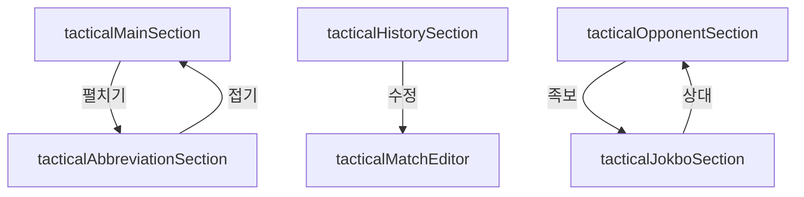

# 전술대항전 섹션 연결

```mermaid
flowchart TD
    MAIN[tacticalMainSection]
    HISTORY[tacticalHistorySection]
    EDITOR[tacticalMatchEditor]
    OPPONENT[tacticalOpponentSection]
    JOKBO[tacticalJokboSection]
    ABBREV[tacticalAbbreviationSection]

    HISTORY -->|수정| EDITOR
    OPPONENT -->|족보| JOKBO
    JOKBO -->|상대| OPPONENT
    MAIN -->|펼치기| ABBREV
    ABBREV -->|접기| MAIN
```
