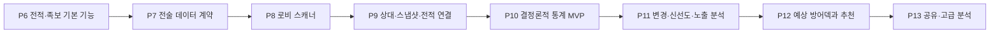

# P7-P13 Tactical Challenge Backend Workflow

이 워크플로는 P6의 전술대항전 기본 기능 이후, 전술대항전 로비 스캔과 전적을 연결해
상대별 방어 이력, 설명 가능한 통계와 예상 방어덱을 제공하는 순서를 고정한다. P6은 실제
학생을 사용한 편성, 전적·메모·족보 저장과 검색·필터까지만 소유하며 고급 통계와 예측은
이 워크플로에서 별도 수직 슬라이스로 구현한다. [@p0-p6-workflow] [@p6-user-flows]

## 활성화 조건과 상태 관리

- P7 production 구현은 P6이 완료되고 P0~P6 상태 문서에서 완료 판정을 받은 뒤 시작한다.
- P6 완료 전에는 v6 조사, fixture 후보와 schema 초안처럼 P6 계약을 바꾸지 않는 읽기 전용
  준비만 할 수 있다.
- P7을 시작할 때 `p7-p13-tactical-backend-workflow-status.md`를 별도로 만들고 단계별
  상태, 입력, 산출물, 검증과 다음 행동을 기록한다.
- 현재 `p0-p6-workflow-status.md`에는 아직 시작하지 않은 P7~P13 상태를 섞지 않는다.
- 각 단계는 독립된 `input.md`, `output.md`와 `artifacts/` 인계 단위로 실행한다.

## 전체 순서

| 단계 | 구현 결과 | 사용자에게 보이는 수준 |
|---|---|---|
| P7 | 전술 DTO, provenance, 저장·import 계약 | v6 자료를 안전하게 이전할 기반 |
| P8 | 상대 선택 로비의 세 행 템플릿 매칭 | 이름·순위·공개 방어 3슬롯 자동 후보 |
| P9 | 상대 identity, 방어 snapshot과 전적 연결 | 상대별 최근 공개·완전 방어 이력 |
| P10 | 공개 시그니처·상대·공격덱 결정론적 집계 | 근거가 보이는 족보·통계 MVP |
| P11 | 반복 스캔 기반 변경·신선도·노출 분석 | 구식 족보와 방어 변경 경고 |
| P12 | 계층적 예상 방어덱과 추천 점수 | 가능한 완전 방어덱 TOP-K와 근거 |
| P13 | 익명 공유와 독립 재현성 분석 | 사용자 간 검증, 시도 횟수와 족보 수명 |

P7부터 P13까지는 순차 의존한다. 선행 계약을 바꾸지 않는 fixture 수집, ROI 조사,
통계 질의 초안과 개인정보 위험 조사는 병렬로 준비할 수 있다.

## 공통 불변식

모든 단계는 기존 Flutter/Python 런타임 경계와 v6 이전 규칙을 유지한다.
[@runtime-boundaries] [@migration-baseline]

1. Flutter는 화면과 review state를, 별도 Python 프로세스는 캡처·매칭·저장·집계를 소유한다.
2. Flutter가 SQLite, 프로필 파일이나 recognition template을 직접 읽지 않는다.
3. v6 코드는 동작 조사와 parity fixture에만 사용하고 런타임 import하지 않는다.
4. 학생은 표시 이름이 아니라 canonical student ID로 저장한다.
5. 로비 관측, 전투 후 확인, 수동 입력, 커뮤니티 제보와 예측을 서로 다른 provenance로
   보존한다.
6. `predicted` 값은 관측 snapshot의 확정 슬롯으로 저장하지 않는다.
7. 실제 빈 슬롯과 화면에서 가려져 알 수 없는 슬롯을 구분한다.
8. 낮은 confidence와 낮은 runner-up margin은 검토 없이 확정하지 않는다.
9. scanner event는 versioned protocol이며 취소와 stale session을 구조적으로 처리한다.
10. runtime UI asset, 학생 recognition template과 상대 이름 template을 분리한다.
11. 통계 API는 원본 관측과 전적을 변경하지 않는 순수 조회 경계다.
12. 공격 성공 사례가 편향된 자료의 비율은 `관측 승률`로 표시하며 실제 승률·방어
    성공률로 표현하지 않는다.
13. 스캔 프레임 수가 아니라 확정된 새로고침 세대를 노출 통계의 표본으로 사용한다.
14. 날짜 없는 기록은 최근 추세, 방어 변경 시점과 족보 수명 계산에서 제외한다.
15. 완전 방어덱 예측은 실제 관측된 덱 시나리오를 우선하고 슬롯별 독립 확률을 조합해
    관측되지 않은 가상 덱을 기본 결과로 만들지 않는다.

## P7 — 전술대항전 데이터 계약과 저장 기반

### 목표

P6 전적·족보 저장을 로비 관측, 상대 identity, 방어 snapshot과 통계로 확장할 수 있도록
데이터 소유권, provenance와 versioned protocol을 고정한다.

### 범위

- 실제 v6 `tactical_challenge.db`의 공격·방어 전적, 부분·완전 덱, 슬롯 순서, 출처,
  날짜 없는 기록, 수동 족보, 와일드카드와 잠재 중복 특성화
- `TacticalDeck`, `TacticalMatch`, `TacticalJokbo`, `TacticalOpponentIdentity`,
  `TacticalDefenseSnapshot`, `TacticalSlotObservation` DTO
- 슬롯 관측 상태 `unknown`, `visible_lobby`, `revealed_after_battle`, `manual`,
  `community_reported`
- `occurred_at`, `observed_at`, `imported_at`, `created_at`, `source`,
  `import_batch_id`, `source_record_id`, `confidence`, `review_status` 분리
- v6 import preview·commit과 idempotency
- Python/Dart 공용 schema와 fixture

P6의 전적 메서드를 호환 확장하거나 별도 tactical protocol version으로 올릴지는 P7
특성화 결과로 결정한다. 메서드 이름을 먼저 고정해 구현을 끌고 가지 않는다.

### 완료 조건

- 실제 v6 사례 fixture가 v7 DTO로 의미 손실 없이 변환된다.
- 같은 import batch와 source record를 다시 가져와도 중복이 생기지 않는다.
- 표시 이름 변경이 저장된 학생 ID를 바꾸지 않는다.
- 가려진 슬롯과 실제 빈 슬롯이 round-trip 후에도 구분된다.
- Python과 Dart가 같은 valid/invalid fixture를 검증한다.
- v6 runtime import와 실제 사용자 저장소에 대한 비검토 쓰기가 없다.

## P8 — 전술대항전 로비 스캐너

### 목표

전술대항전 상대 선택 화면에서 현재 순위와 상대 세 명의 이름, 순위, 공개 스트라이커
1번과 스페셜 2명을 OCR 없이 템플릿 매칭으로 읽어 검토 가능한 후보를 만든다.

### 범위

- 게임 창 캡처와 지원 해상도별 ROI profile
- 현재 순위와 상대 순위의 제한된 숫자 glyph template matching
- 상대 이름 ROI의 등록 template matching
- 공개 학생 3슬롯의 portrait matching
- 학생·이름별 score, runner-up, margin과 전체 confidence
- 화면 hash, 스캔 시각과 refresh generation 후보
- P5 scanner session 계약을 재사용한 start, cancel, event, review, confirm, discard
- 미등록 상대를 잘못된 기존 상대에 붙이지 않는 unresolved identity 후보
- 닉네임 template 등록·갱신을 위한 검토 경계

이름 template matching은 처음 보는 문자열을 읽지 못한다. 미등록 이름은 임시 identity로
남기고 사용자가 한 번 확인한 뒤 이후 스캔에 재사용한다. 프로필 초상은 중복될 수 있으므로
상대 identity의 단독 근거로 사용하지 않는다.

### 중복 표본 규칙

- 같은 상대 세 명, 순위, 공개 시그니처와 유사한 화면 hash는 같은 refresh generation으로
  묶는다.
- 일정 시간 동안 같은 화면을 여러 프레임 읽어도 노출 표본은 하나다.
- 후보 세트가 실제로 바뀌거나 사용자가 새로고침을 확정한 경우에만 새 generation을 만든다.
- 새로고침 애니메이션이나 부분적으로 그려진 화면은 확정 후보로 저장하지 않는다.

### 완료 조건

- 지원 fixture에서 세 상대를 행별로 독립 인식한다.
- 미등록 이름, 긴 이름, 유사 이름, 다른 배율과 부분 가림 사례가 있다.
- 낮은 score나 margin은 review-required가 되며 repository에 자동 commit되지 않는다.
- 취소, stale event와 동일 화면 반복 캡처가 검증된다.
- runtime UI asset과 이름·학생 template이 별도 packaging 경계를 유지한다.

## P9 — 상대 Identity, 방어 Snapshot과 전적 연결

### 목표

로비에서 본 상대와 공개 방어를 결과 스크린샷·수동 전적에 연결해 상대별 방어 이력을
만든다.

### 저장 모델

- `tactical_lobby_scans`: profile, observed time, season, map, current rank, refresh
  generation, screen hash와 ROI profile
- `tactical_lobby_candidates`: display index, opponent identity, opponent rank, 공개
  시그니처, confidence, selected 상태와 match link
- `tactical_opponent_identities`: 현재·과거 표시 이름, 이름 template, 최초·최종 관측과
  수동 확인 상태
- `tactical_defense_snapshots`: 상대, 관측 시각, 공개·완전 덱, 슬롯 provenance,
  confidence와 원본 scan/match link

### 연결 규칙

- 사용자가 공격 상대를 선택하면 로비 candidate에 선택 시각을 기록한다.
- 결과 화면에서 공격덱, 완전 방어덱과 승패를 얻으면 직전 선택 candidate를 연결한다.
- 동일 상대, 합리적인 시간 범위, 공개 3슬롯과 시즌 일치를 자동 연결 근거로 사용한다.
- 후보가 둘 이상이거나 근거가 충돌하면 자동 연결하지 않고 review 대상으로 남긴다.
- 한 전적은 한 로비 candidate에만 연결하되 사용자는 연결 취소·재지정을 할 수 있다.

### 완료 조건

- 로비 공개 3슬롯과 전투 후 완전 덱이 하나의 이력으로 연결된다.
- 닉네임 변경과 template 추가가 기존 상대 이력을 분리하거나 덮어쓰지 않는다.
- 전투하지 않은 candidate도 결과 없는 노출 관측으로 보존된다.
- 예측 또는 과거 최빈 덱이 실제 snapshot처럼 저장되지 않는다.
- 자동 연결, 모호한 연결, 수동 재연결과 삭제 fixture가 통과한다.

## P10 — 결정론적 통계 MVP

### 목표

확률 예측 전에 설명 가능한 집계만으로 공개 시그니처, 상대와 공격덱에 대한 실용적인
통계와 족보 근거를 제공한다.

### 범위

- 공개 방어 `스트라이커 1번 + 스페셜 2명` 시그니처별 관측 횟수와 상대 수
- 시그니처별 공격덱 채택 분포, 관측 승·패와 출처 구성
- 시그니처별 전투 후 확인된 완전 방어덱 분포와 다양성
- 상대별 최근 공개·완전 방어, 자주 사용한 방어와 공격덱별 관측 결과
- 완전 동일 공격덱, 스트라이커·스페셜 동일, 한 자리 변형과 핵심 3·4인 코어 집계
- 날짜 보유율, 서로 다른 상대 수, 출처 집중도, 중복 의심과 최근 검증 여부
- Wilson 구간 또는 설명 가능한 베이지안 표본 보정
- season, source, opponent, public signature와 기간 필터

### 표시 의미

허용하는 이름은 `관측 승률`, `공격덱 채택률`, `관측 상대 수`, `검증 기록`, `출처
구성`, `표본 신뢰도`다. 모집단 분모가 없는 자료를 `실제 승률`, `방어 성공률`, `확정
카운터`나 인과적 `학생 기여도`로 표시하지 않는다.

### 완료 조건

- 모든 집계가 고정 fixture와 독립 기준 계산의 기대값에 일치한다.
- 공격/방어, 출처와 시즌이 명시적 필터 없이 섞이지 않는다.
- 날짜 없는 기록이 최근 추세나 신선도에 들어가지 않는다.
- 필터가 분모와 분자를 같은 population으로 제한한다.
- 통계 조회가 원본 데이터와 cache key 밖의 상태를 변경하지 않는다.

P10은 첫 실용 출시 gate다. 여기까지 완료하면 로비 스캔 직후 상대 세 명의 최근 완전
방어, 공개 시그니처에 연결된 족보와 근거 표본을 제공할 수 있다.

## P11 — 방어 변경, 신선도와 노출 분석

### 목표

반복 로비 스캔을 이용해 상대의 공개 방어 변경 구간, 족보 신선도와 사용자에게 실제로
제시된 선택지의 분모를 분석한다.

### 범위

- 공개 슬롯 변경과 공개 유지 중 전투 후 확인된 완전 덱 변경
- 변경 전 마지막 관측과 변경 후 최초 관측으로 표현한 변경 시간 구간
- 공개 시그니처 유지 기간과 과거 방어 재사용
- 새로고침당 상대 등장, 순위 조건별 등장과 연속 refresh 잔류
- 노출 → 선택 → 전투 → 결과 funnel
- 상대·공개 시그니처·순위 차이별 선택률
- 마지막 성공·실패, 현재 공개 덱 관측 이후와 변경 이후 검증
- 오래된 근거의 시간 감쇠와 구식 족보 경고

현재 순위의 약 0.7배까지가 후보 범위여도 한 refresh에서 보이는 것은 게임이 선택한
세 명뿐이다. 따라서 결과는 `현재 사용자에게 노출된 빈도` 또는 `해당 순위 조건에서
관측된 분포`로 표현하며 서버 전체 메타 점유율로 확대하지 않는다.

### 완료 조건

- 같은 refresh generation의 반복 프레임이 노출률을 올리지 않는다.
- 날짜 없는 기록은 변경 시계열과 족보 수명 계산에서 제외된다.
- 변경 시각을 단일 확정 시각이 아니라 관측 구간으로 반환한다.
- 전투하지 않은 후보를 성공·실패 분모에 넣지 않는다.
- 노출률, 선택률과 관측 승률을 서로 다른 필드와 문구로 반환한다.

## P12 — 예상 방어덱과 설명 가능한 추천

### 목표

현재 상대, 공개 시그니처, 시즌·순위 조건과 시간 이력을 이용해 가능한 완전 방어덱
시나리오와 공격덱 추천 근거를 제공한다.

### 계층적 예측 순서

1. 같은 상대, 같은 공개 시그니처와 현재 시즌
2. 같은 상대와 같은 공개 시그니처
3. 같은 상대의 최근 완전 방어
4. 같은 시즌과 같은 공개 시그니처
5. 같은 순위 조건과 같은 공개 시그니처
6. 전체 상대의 같은 공개 시그니처

표본이 적으면 상대 전용 분포를 더 넓은 공개 시그니처 분포로 보정하고, 오래된 관측은
시간 감쇠한다. fallback 단계와 실제 근거 표본을 응답에 포함한다.

### 출력

- 완전 방어덱 TOP-K, 상대 점유율과 마지막 확인 시각
- 각 시나리오의 근거 상대·전적·snapshot 수
- 숨은 슬롯별 보조 후보
- 공개 시그니처 모호성과 변형 방어 가능성
- 예측 confidence 또는 검증 전 신뢰 등급
- 같은 상대·완전 덱·공개 시그니처별 공격덱 추천과 보유 학생 적용 가능 여부
- 추천 점수를 구성한 최근성, 표본, 상대 범위와 출처 근거

### 검증

전투 후 완전 방어가 확인되면 TOP-1, TOP-K, 숨은 슬롯별 적중, Brier score, log loss와
confidence calibration을 기록한다. 시간 순서가 보존된 holdout으로 검증하며 같은
snapshot을 학습과 평가에 동시에 사용하지 않는다.

### 완료 조건

- 예측이 관측 snapshot과 별도 저장·조회된다.
- fallback과 근거 없는 확률을 반환하지 않는다.
- 검증된 calibration gate 전에는 정밀 백분율 대신 높음·보통·낮음과 근거 표본을
  기본 표시로 사용한다.
- 규칙 기반 baseline과 시간 분리 backtest 결과가 artifact로 남는다.
- 추천 점수는 단일 숫자뿐 아니라 구성 근거를 함께 반환한다.

## P13 — 공유 데이터와 고급 분석

### 목표

여러 사용자가 공유하는 자료에서 독립 재현성, 시도 횟수, 출처 집중도와 족보 수명을
분석하되 상대 identity와 원본 ROI의 개인정보 경계를 유지한다.

### 추가 계약

- 설치·공유 범위가 명시된 익명 `contributor_id`
- `share_id`, `shared_at`, 실제 `occurred_at`
- `attempt_session_id`, `attempt_index`
- `defense_snapshot_id`, 순위 조건, patch, map과 season
- import batch와 원본 중복을 판별할 source identity
- 공유 전 redaction, 최소 표본, 삭제와 로컬 폐기 정책

### 가능한 분석

- 독립 사용자와 독립 방어 상대 재현성
- 최대 기여자 비중과 한 제보자 집중도
- 첫 시도 성공률, 평균·중앙값 시도 횟수와 1·2·3회 누적 돌파율
- 발견자와 다른 사용자의 관측 성과 차이
- 족보 최초 발견, 마지막 검증과 유효 기간
- 공유 확산과 변경 감지 이후 재검증
- 시즌, patch, map과 순위 조건별 차이
- 한 자리 대체 학생의 사용자 간 재현성

### 개인정보 경계

- 상대 이름 ROI와 원본 스크린샷은 기본적으로 로컬 전용이다.
- 공유 통계는 상대 이름 대신 범위가 제한된 익명 ID를 사용한다.
- 원본 ROI나 스크린샷 업로드는 별도 명시적 동의 없이는 수행하지 않는다.
- 작은 표본의 상대 전용 자료는 외부 공유 결과에서 숨긴다.
- 익명 ID를 다른 설치·시즌·서비스의 장기 추적 ID로 재사용하지 않는다.

### 머신러닝 gate

머신러닝은 P13 자체의 기본 완료 조건이 아니다. 독립 contributor, 실제 경기 시각,
attempt 단위, 시간 분리 train/test와 규칙 기반 baseline이 확보되고 설명 가능한 개선이
검증된 뒤 별도 단계로 승인한다. 시즌 전환 시 모델 폐기·재학습과 fallback 정책이 없는
모델은 production 추천에 사용하지 않는다.

### 완료 조건

- 공유 payload에서 원본 이름 ROI와 로컬 상대 이름이 기본적으로 제거된다.
- 독립 사용자 수와 경기 수를 혼동하지 않는다.
- 첫 시도와 재도전이 attempt session fixture로 재현된다.
- 삭제·철회와 중복 import가 집계 cache까지 일관되게 반영된다.
- 개인정보, 편향과 최소 표본 정책을 contract test와 운영 문서로 검증한다.

## 단계별 출시 기준

| 출시 범위 | 포함 단계 | 의미 |
|---|---|---|
| 전술 통계 MVP | P7~P10 | 로비 자동 입력, 상대 이력과 설명 가능한 족보 통계 |
| 로컬 전술 분석 완성 | P7~P12 | 변경 감지, 신선도와 예상 완전 방어덱 |
| 공유 분석 | P7~P13 | 독립 사용자 재현성, 시도 횟수와 족보 수명 |

P10 이후에는 사용자가 스캔한 상대 세 명에 대해 최근 공개·완전 방어와 근거가 있는
공격덱을 제공할 수 있다. P11~P12는 반복 관측과 예측 품질을 추가하며, P13은 로컬 기능의
완료와 분리된 opt-in 공유 단계로 취급한다.

## 단계별 작업과 인계

각 단계는 다음 순서로 진행한다.

1. 해당 단계 전에 승인된 선행 단계 fixture와 contract test를 baseline gate로 재현한다.
2. v6 동작 또는 실제 화면이 필요한 경우 읽기 전용 조사와 최소 parity fixture를 먼저
   만든다.
3. DTO·schema·protocol을 고정한 뒤 repository, scanner 또는 analytics 구현을 연결한다.
4. Python 단위·contract test, Dart contract·service test, 필요한 Widget test와 실제
   process E2E를 실행한다.
5. Windows release build와 scanner asset packaging을 검증한다.
6. 슬레이브는 `output.md`와 실제 patch·fixture·검증 artifact를 함께 반환한다.
7. 마스터가 직접 결과와 완료 조건을 확인한 뒤에만 상태 문서의 단계를 완료로 바꾼다.

